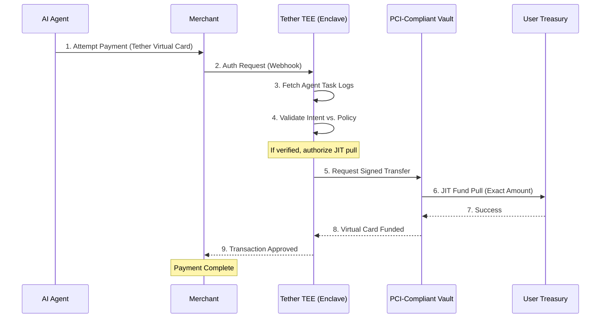

# Architecture & Security

Tether is built on the principle of **Zero-Discretionary Control**. This ensures that even if our infrastructure is compromised, your funds remain protected by hardware-level isolation.

## The Sequence of a Transaction

The following diagram shows the end-to-end flow of a transaction, from the agent's attempt to pay to the final JIT settlement.

## Key Components

### 1. Trusted Execution Environment (TEE)
The "Brain" of Tether lives in an AWS Nitro Enclave. This is a hardware-isolated environment where your governance policies and treasury keys are sealed. Tether developers and servers cannot view or modify the data inside the enclave once it is deployed.

### 2. Intent Validation Engine
Unlike traditional systems that only check whitelists, Tether ingests the **Agent's LLM Task Log**. 
*   **The Check:** If the agent is currently tasked with "Booking a flight for Kunal," the TEE will only approve transactions from airline merchants for the specified amount range.
*   **The Result:** It prevents "hallucination spending" where an agent might buy something "allowed" (like an ebook) but completely irrelevant to its current mission.

### 3. JIT (Just-In-Time) Funding
Your cards stay empty until the millisecond they are needed. This eliminates the risk of card exfiltration. Even if an agent's credentials are leaked, they cannot be used by a third party because the TEE will see that the unauthorized use doesn't match an active agent task.

### 4. Zero-Data Vaulting
Sensitive cardholder data is stored in a PCI Level 1 certified vault. Tether handles **Tokens**, not PANs. This minimizes our compliance footprint while keeping your raw credentials safe from our primary backend.
