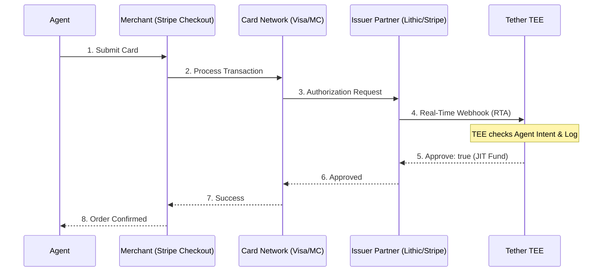

# Architecture & Security

Tether is built on the principle of **Zero-Discretionary Control**. This ensures that even if our infrastructure is compromised, your funds remain protected by hardware-level isolation.

## How the JIT Webhook Connects (The "Last Mile")

A common question is: **How does a merchant's checkout page (e.g., Farfetch using Stripe) talk to Tether's TEE?**

Tether utilizes the standard **ISO 8583** card network authorization flow. We don't need a custom integration with every merchant because we sit at the **Issuer Level**.

### The Network Flow:
1.  **Checkout:** The agent enters the Tether Virtual Card details into the merchant's payment field (Stripe, Adyen, Braintree, etc.).
2.  **Acquirer Processing:** The merchant's payment processor (e.g., Stripe) sends the transaction to the **Card Network** (Visa/Mastercard).
3.  **Real-Time Authorization (RTA):** The Card Network identifies that the card was issued by Tether's partner (e.g., Lithic or Stripe Issuing) and routes the request to them.
4.  **The JIT Webhook:** Tether's Issuer Partner sends a synchronous **Real-Time Authorization Webhook** (`issuing_authorization.request`) to Tether's TEE.
5.  **TEE Validation:**
    *   The TEE receives the merchant's metadata (Name, Category, Amount).
    *   The TEE cross-references this with the **Agent's Task Logs**.
    *   **The Decision:** If the intent is verified, the TEE responds with `{"approve": true}`.
6.  **Success:** The Card Network approves the transaction at the merchant's terminal in milliseconds.

### Why this is Secure:
The merchant (Farfetch) **never knows Tether exists**. They just see a standard Visa/Mastercard. The "Trust" happens between the **Issuer (Tether)** and the **Card Network**. This ensures Tether is immediately compatible with 150M+ merchants worldwide.

## Key Components

### 1. Trusted Execution Environment (TEE)
The "Brain" of Tether lives in an AWS Nitro Enclave. This is a hardware-isolated environment where your governance policies and treasury keys are sealed. Tether developers and servers cannot view or modify the data inside the enclave once it is deployed.

### 2. Intent Validation Engine
Unlike traditional systems that only check whitelists, Tether ingests the **Agent's LLM Task Log**. 
*   **The Check:** If the agent is currently tasked with "Booking a flight for Kunal," the TEE will only approve transactions from airline merchants for the specified amount range.
*   **The Result:** It prevents "hallucination spending" where an agent might buy something "allowed" (like an ebook) but completely irrelevant to its current mission.

### 3. JIT (Just-In-Time) Funding
Your cards stay empty until the millisecond they are needed. This eliminates the risk of card exfiltration. Even if an agent's credentials are leaked, they cannot be used by a third party because the TEE will see that the unauthorized use doesn't match an active agent task.

### 4. Zero-Data Vaulting
Sensitive cardholder data is stored in a PCI Level 1 certified vault. Tether handles **Tokens**, not PANs. This minimizes our compliance footprint while keeping your raw credentials safe from our primary backend.
