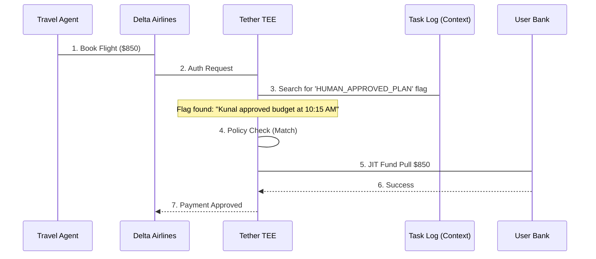

# The Corporate Travel Agent

## The Problem
Booking corporate travel is a high-trust task. Flights and hotels often exceed $500, making them a target for "rogue agent" spending or simple hallucinations. Currently, most teams force a human to approve every single booking, which defeats the purpose of an autonomous agent.

## Implementation
Tether allows for **Threshold-Based Autonomy**. You can automate small bookings and require human "Oracle" validation for expensive ones—all without sharing your real card.

```typescript
const travelCard = await tether.issueCard({
  name: 'Team Travel Card',
  policy: {
    dailyLimit: 2000,
    merchantWhitelist: ['Delta', 'Marriott', 'Uber', 'Expedia'],
    // Automatic approval for small items, human-verified for large ones
    dynamicApproval: {
      threshold: 500,
      requireLogFlag: 'HUMAN_APPROVED_PLAN'
    }
  }
});
```

## Transaction Flow


## Conclusion
The user achieved **Safe Scalability**. They can approve a "Plan" in Slack ("Go book that $850 flight"), and Tether ensures the agent executes *exactly* that plan. The user keeps their keys, and the agent never sees the corporate credit line.
