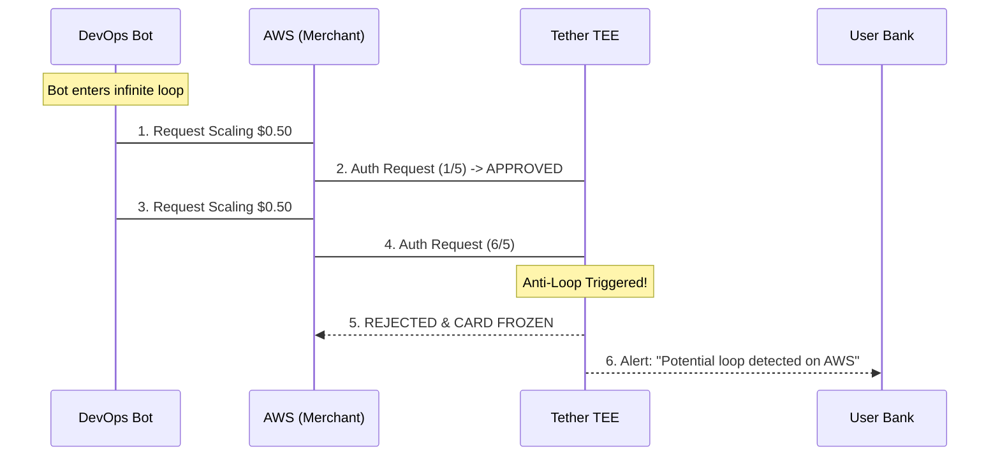

# The DevOps Automation Bot

## The Problem
DevOps bots need to pay for burst infrastructure (AWS Lambda, Vercel bandwidth). The risk isn't just malicious use; it's **infinite loops**. A bug in an auto-scaling script could trigger thousands of micro-transactions, draining an account in minutes before a human notices.

## Implementation
Tether provides **Real-Time Loop Protection** at the card network level.

```typescript
const devOpsCard = await tether.issueCard({
  name: 'Infrastructure Bursts',
  policy: {
    monthlyLimit: 5000,
    categories: ['Cloud Computing'],
    // Specialized agentic guardrails
    protections: {
      antiLoop: {
        maxFrequency: 5, // max transactions
        perPeriod: 60,   // seconds
        action: 'FREEZE_CARD'
      }
    }
  }
});
```

## Transaction Flow


## Conclusion
The user achieved **Financial Safety**. By shifting loop detection from "after-the-fact" cloud bills to "real-time" authorization, Tether prevents catastrophic bugs from becoming bank-breaking events.
