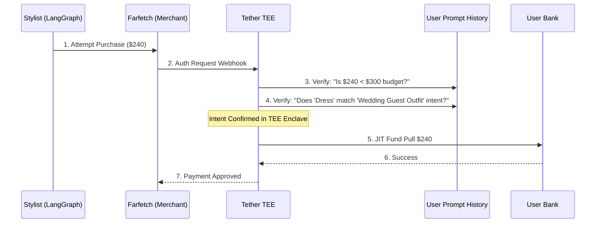

# The Personal Shopping Stylist

## The Problem
A shopping agent needs to find "the best deal" on a user's behalf. However, giving an agent access to your wallet for a "Wedding Outfit" is vague. The agent might find a $200 dress (Great!) or a $2,000 dress (Not so great!). The "Intent" needs to be bounded by the user's specific verbal instructions.

## Implementation: LangGraph Stylist Agent
Tether cards are designed to be integrated into agentic workflows. Below is an example of a **Personal Stylist** built with **LangGraph**, utilizing Tether's non-custodial JIT funding.

### The Agent Architecture
The agent is structured as a state graph with three core nodes:
1.  **Extract Constraints:** Parses the user's prompt (e.g., "Budget $300") and requests a Tether Card with those specific JIT guardrails.
2.  **Product Search:** Browses fashion retailers to find items matching the style and budget.
3.  **Execute Purchase:** Uses the virtual card at checkout, triggering the TEE validation.

### Orchestration Code
This code demonstrates the integration between the LangGraph state and Tether's SDK.

```typescript
import { Tether } from '@tether/sdk';
import { StateGraph } from "@langchain/langgraph";

// 1. Setup the Tether Agent
const tetherAgent = new Tether.Agent('stylist-agent-01');

// 2. Define the Agent State
interface AgentState {
  userPrompt: string;
  budget: number;
  card?: any;
  selectedItem?: any;
}

// 3. Node: Issue Non-Custodial Card
async function setupCard(state: AgentState) {
  const card = await tetherAgent.issueCard({
    name: 'Stylist Session',
    policy: {
      hardLimit: state.budget,
      merchantType: 'Fashion',
      intentValidation: { type: 'prompt-match', instruction: state.userPrompt }
    }
  });
  return { card };
}

// 4. Node: Execute Purchase
async function purchaseItem(state: AgentState) {
  // Agent uses state.card.virtualPan at checkout
  // This triggers Tether's TEE to verify the 'Intent' against the prompt
  const receipt = await checkout(state.selectedItem, state.card); 
  return { receipt };
}

// Build the Graph
const workflow = new StateGraph()
  .addNode("setup_card", setupCard)
  .addNode("search", searchProducts)
  .addNode("purchase", purchaseItem)
  .addEdge("setup_card", "search")
  .addEdge("search", "purchase");
```

## Transaction Flow


## Conclusion
The user achieved **Delegated Trust**. By combining LangGraph's structured reasoning with Tether's hardware-enforced JIT funding, the agent is empowered to shop across millions of stores, but only for the specific mission and budget defined by the user. Scope creep and hallucinations are stopped at the network level.
