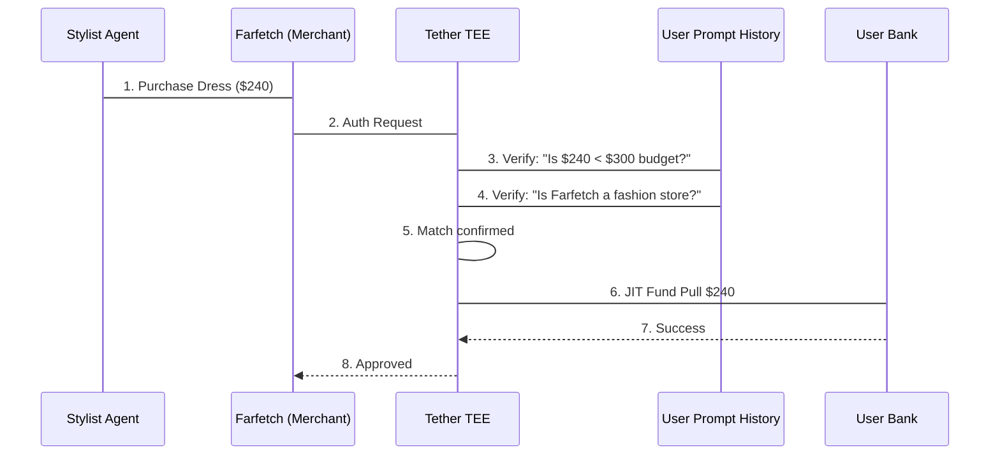

# The Personal Shopping Stylist

## The Problem
A shopping agent needs to find "the best deal" on a user's behalf. However, giving an agent access to your wallet for a "Wedding Outfit" is vague. The agent might find a $200 dress (Great!) or a $2,000 dress (Not so great!). The "Intent" needs to be bounded by the user's specific verbal instructions.

## Implementation
Tether allows you to bind a card to a **Prompt-Derived Budget**.

```typescript
// User says: "Find me a wedding guest outfit, budget is $300"
const stylistCard = await tether.issueCard({
  name: 'Wedding Outfit Budget',
  policy: {
    // Extracted from the user's verbal instruction
    hardLimit: 300,
    merchantType: 'Fashion',
    intentValidation: {
      type: 'prompt-match',
      instruction: 'Wedding Guest Outfit'
    }
  }
});
```

## Transaction Flow


## Conclusion
The user achieved **Delegated Trust**. They can give "spending power" to an agent for a specific task without worrying about "scope creep." The agent is empowered to shop across millions of stores, but only for the specific mission and budget defined by the user.
