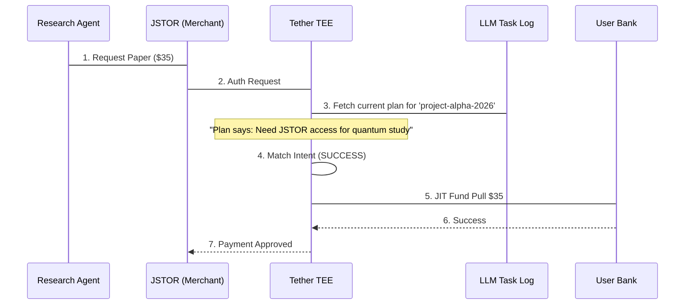

# The Research Assistant

## The Problem
Research agents often need to pay for academic papers, data credits, and API access. Traditional virtual cards are "context-blind"—if you give an agent a $50 budget for "Research," it might spend it on a textbook from Amazon instead of the specific IEEE paper you needed. 

Without Tether, you either have to manually approve every $5 transaction or risk the agent "hallucinating" its way through your budget on irrelevant resources.

## Implementation
The following code demonstrates how to issue a Tether Card with a **Contextual Intent Policy**.

```typescript
import { Tether } from '@tether/sdk';

const agent = new Tether.Agent('research-bot-01');

// Define a policy that validates against the agent's task log
const card = await agent.issueCard({
  name: 'Data & Paper Budget',
  fundingSource: 'corporate-treasury',
  policy: {
    maxTransaction: 50,
    categories: ['Education', 'SaaS'],
    // The "Magic": TEE validates the intent in the agent's scratchpad
    validation: {
      type: 'intent-context',
      matchPrompt: 'Must be cited in task-log as a required data source',
      taskContextId: 'project-alpha-2026'
    },
    loopProtection: true
  }
});

console.log(`Issued Card: ${card.virtualPan}`);
```

## Transaction Flow


## Conclusion
By anchoring the payment to the **Agent's Task Log**, the user achieved **unattended autonomy**. The agent can now buy 20 different papers in the middle of the night, but if it gets distracted and tries to buy a PlayStation, the TEE identifies the "Intent Drift" and blocks the transaction instantly.
